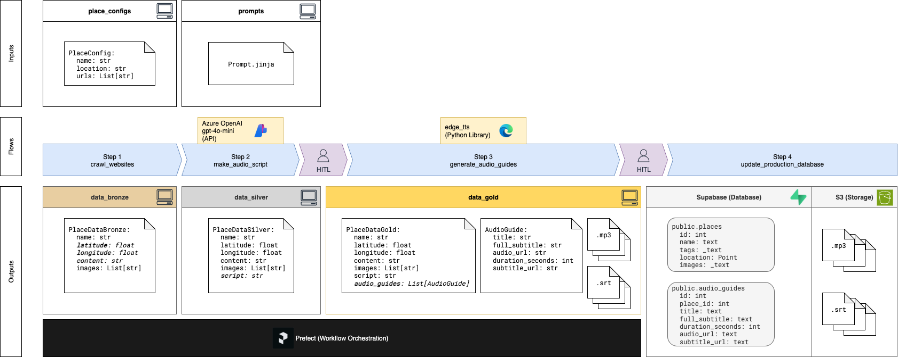
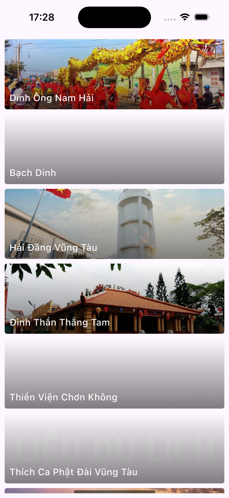
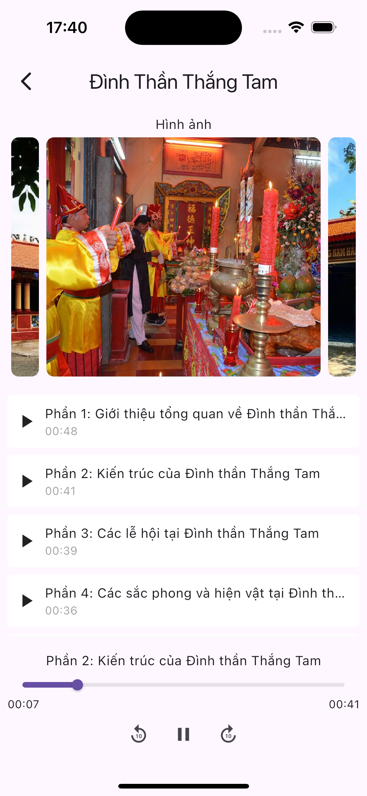

# localg*AI*d (localguide)
My AI travel companion that acts like a local guide — introducing popular places through immersive audio guides and local insights.

# Why?
- I love traveling and learning about the culture and history of places.
- Not many places have audio guides, usually just written info. I want to listen to the stories while appreciating the scenery, architecture, or historical objects.
- I love making apps that are useful, at least for myself first.
- I want to learn as I do, things like data transformation pipelines, AI, and trying out various tech stacks.
- I hope to grow the app in the future with rich and accurate information, giving tourists a way to be educated while enjoying their trip.

# The data pipeline behind
Source code: [data_pipeline](data_pipeline/)

> Experiments with the tools and frameworks can be found in the [experiments](experiments/) folder.

The transformation steps (and the tools used) are:
1. Crawl data about the places from the Internet ([crawl4ai](https://github.com/unclecode/crawl4ai))
2. Use GenAI to create audio scripts ([Azure OpenAI - gpt-4o-mini](https://azure.microsoft.com/en-us/products/ai-services/openai-service))
3. Use a free service to read the scripts out loud ([edge_tts](https://github.com/rany2/edge-tts))
4. Upload the scripts and audio guides to serve the mobile app ([AWS S3](https://aws.amazon.com/s3/) and [supabase](https://supabase.com/))

I used [Prefect](https://github.com/PrefectHQ/Prefect) to orchestrate the steps in the pipeline, and 2 manual approval steps before step 3 and step 4.

> Note: each step would produce a run result object but I have dropped them for now.

Example artifacts from each step:

Step 0. Input for the next step is the config for the place, I collected the information manually to make sure the sources are legit: [vungtau_dinhthanthangtam.json](data_pipeline/run_data/place_configs/vungtau_dinhthanthangtam.json)

Step 1. Produces the bronze data, containing crawled information: [Đình Thần Thắng Tam.json](data_pipeline/run_data/data_bronze/6c07f0af-97df-4904-876a-b56ab7edc7d7/Đình%20Thần%20Thắng%20Tam.json)

Step 2. Produces the silver data, extended with audio scripts: [Đình Thần Thắng Tam.json](data_pipeline/run_data/data_silver/6c07f0af-97df-4904-876a-b56ab7edc7d7/Đình%20Thần%20Thắng%20Tam.json)

Step 3. Produces the gold data, which are audio files and subtitles, example of one audio guide:
- The audio file: [01_Phần-1:-Giới-thiệu-tổng-quan-về-Đình-thần-Thắng-Tam.mp3](data_pipeline/run_data/data_gold/6c07f0af-97df-4904-876a-b56ab7edc7d7/01_Phần-1:-Giới-thiệu-tổng-quan-về-Đình-thần-Thắng-Tam.mp3)
- The subtitle text: [01_Phần-1:-Giới-thiệu-tổng-quan-về-Đình-thần-Thắng-Tam.srt](data_pipeline/run_data/data_gold/6c07f0af-97df-4904-876a-b56ab7edc7d7/01_Phần-1:-Giới-thiệu-tổng-quan-về-Đình-thần-Thắng-Tam.srt)

Step 4. Upload the audio and subtitle files to remote storages.
- S3: for storing the audio and subtitle files.
- Supabase: for information about the place and its audio guide metadata.

# The mobile app
Source code: [localgaid_mobile](localgaid_mobile/)

The app is written using [Flutter](https://github.com/flutter/flutter), connected to S3 using [AWS Amplify](https://github.com/aws-amplify/amplify-flutter) and Supabase using [Supabase SDK for Flutter](https://github.com/supabase/supabase-flutter).

I tried to be minimal first before extending the features and refining the UI.

These are the screenshots of the app:
| Home screen | Audio guide screen  |
| - | - |
| List of popular places in Vung Tau that I'm gonna visit | A simple audio guide player screen with images of the place |
|  |  |

# localg*AI*d in action
Here's a picture of me using the app while at Bach Dinh, Vung Tau. Had a fun time listening to the stories while exploring new places.

# References and Attributions

This project uses Crawl4AI (https://github.com/unclecode/crawl4ai) for web data extraction.
